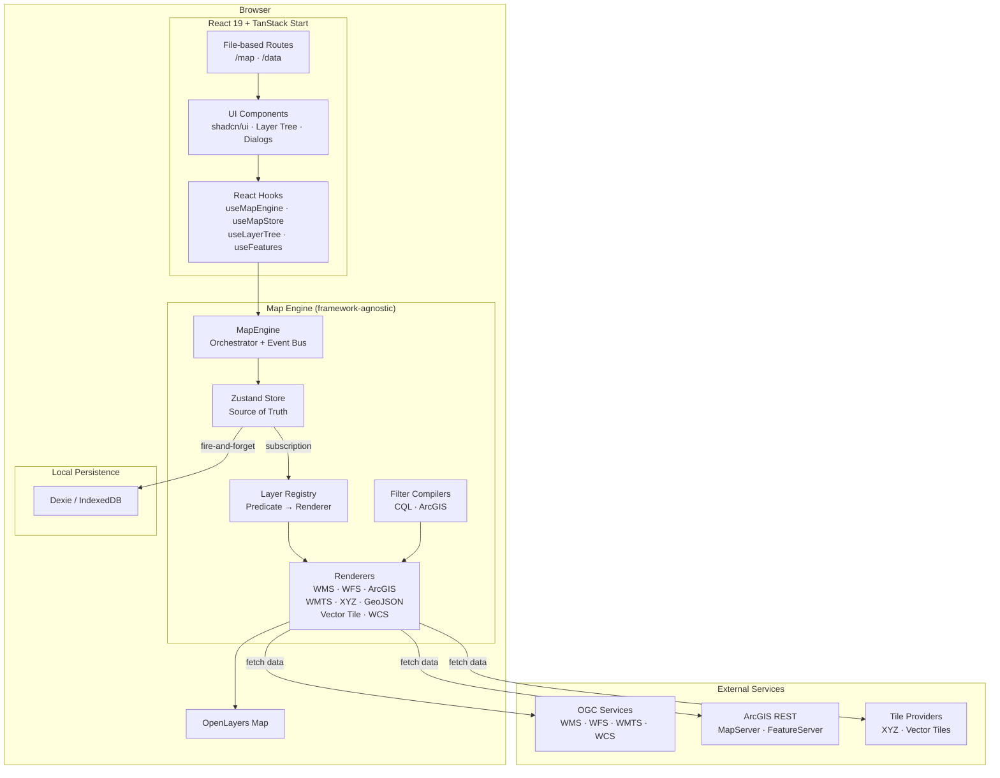
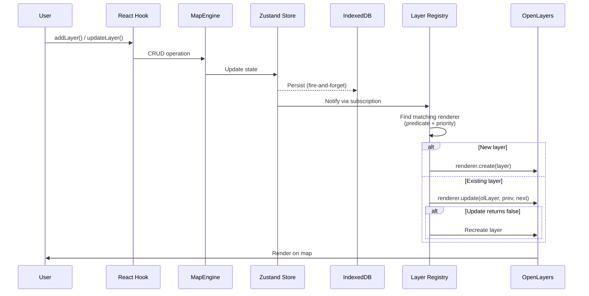
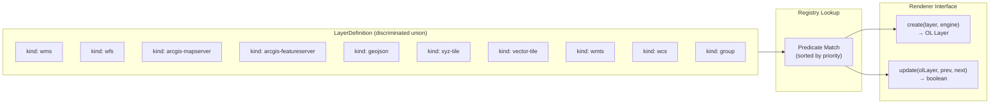

# OpenGeo

An open-source geospatial web client for visualizing and managing map layers from a variety of OGC and commercial services. Built with React 19, OpenLayers, and TanStack Start.

**Live demo:** [map.opengeo.space](https://map.opengeo.space)

## Screenshots

<!-- Replace these placeholders with actual screenshots -->

| Map View | Layer Management |
|---|---|
|  |  |

| Data Discovery | Feature Inspection |
|---|---|
|  |  |

| Filter Editor | Dark Mode |
|---|---|
|  |  |

## Features

- **Multi-source layer support** — WMS, WFS, WMTS, WCS, XYZ tiles, Vector tiles, GeoJSON, ArcGIS MapServer, and ArcGIS FeatureServer
- **Layer management** — Drag-and-drop layer tree with visibility toggling, opacity control, grouping, and per-layer styling
- **Service discovery** — Browse and add layers from remote catalogs and ArcGIS REST directories
- **Feature inspection** — Click-to-identify features with attribute popups and detail sheets
- **Filtering** — Build CQL and ArcGIS-compatible filters with a visual editor
- **Persistence** — Layers and data sources are saved locally via IndexedDB (Dexie)
- **Import/Export** — Save and load layer configurations as JSON
- **Dark mode** — Full light/dark theme support
- **Base layer presets** — Switch between OpenStreetMap, satellite imagery, and other base maps
- **SSR-ready** — Server-side rendered with TanStack Start and Nitro

## Tech Stack

| Category | Technology |
|---|---|
| Framework | [TanStack Start](https://tanstack.com/start) (SSR via Nitro) |
| UI | [React 19](https://react.dev), [shadcn/ui](https://ui.shadcn.com) (base-mira style), [Tailwind CSS v4](https://tailwindcss.com) |
| Map engine | [OpenLayers 10](https://openlayers.org), [ArcGIS Core](https://developers.arcgis.com/javascript/) |
| State | [Zustand](https://zustand.docs.pmnd.rs), [Dexie](https://dexie.org) (IndexedDB) |
| Routing | [TanStack Router](https://tanstack.com/router) (file-based) |
| Language | TypeScript (strict mode) |
| Deployment | Docker, Helm, k3s, GitHub Actions |

## Getting Started

### Prerequisites

- [Node.js](https://nodejs.org) 20+
- [pnpm](https://pnpm.io) 9+

### Install & Run

```bash
git clone https://github.com/<your-username>/opengeo.git
cd opengeo
pnpm install
pnpm dev
```

Open [http://localhost:3000](http://localhost:3000) in your browser.

### Scripts

| Command | Description |
|---|---|
| `pnpm dev` | Start dev server on port 3000 |
| `pnpm build` | Production build (outputs to `.output/`) |
| `pnpm test` | Run tests (vitest) |
| `pnpm check` | Auto-fix formatting + linting |
| `pnpm lint` | ESLint only |
| `npx tsc --noEmit` | TypeScript type checking |

## Architecture

### High-Level Overview



### Data Flow



### Layer Type System



### Map Engine (`src/map-engine/`)

The map engine uses a layered architecture where domain types are decoupled from the OpenLayers rendering target.

**Key modules:**

- **`types/`** — Domain types. `LayerDefinition` is a discriminated union on `kind` (WMS, WFS, ArcGIS MapServer/FeatureServer, GeoJSON, XYZ, Vector Tile, WMTS, WCS, Group). Styles are declarative descriptors, not OL objects.
- **`registry/`** — Predicate + renderer pairs sorted by priority. Extensibility mechanism — add new layer types by registering a predicate + renderer without touching core code.
- **`renderers/`** — Each renderer implements `create()` and `update()`. Update returns `true` for in-place updates, `false` to trigger recreation.
- **`engine/`** — Central orchestrator. Owns the OL map instance, layer/feature CRUD, view management, and event bus. Framework-agnostic.
- **`store/`** — Zustand vanilla store with flat `Record<string, LayerDefinition>` and `parentId` references. Tree structure is derived via selectors.
- **`hooks/`** — React bindings: `useMapEngine()`, `useMapStore(selector)`, `useLayerTree()`, `useLayer(id)`, `useFeatures(layerId)`, `useMapView()`, `useMapEvent()`.
- **`filter/`** — CQL and ArcGIS filter compilers for server-side feature filtering.

### Routing

File-based routing via TanStack Router in `src/routes/`:

- `/` — Redirects to `/map`
- `/map` — Map view with layer panel, viewport, and feature popups
- `/data` — Data source discovery and management

### UI

60+ shadcn/ui components in `src/components/ui/` using the base-mira style variant with `@base-ui/react` and `lucide-react` icons.

## Deployment

### Docker

```bash
docker build -t opengeo .
docker run -p 3000:3000 opengeo
```

### Kubernetes (Helm)

A Helm chart is provided in `helm/opengeo/`:

```bash
helm upgrade --install opengeo ./helm/opengeo \
  --set image.repository=ghcr.io/<your-username>/opengeo \
  --set image.tag=latest
```

The included GitHub Actions workflow (`.github/workflows/deploy.yaml`) builds the Docker image, pushes to GHCR, and deploys to a k3s cluster via Helm on every push to `main`.

## Project Structure

```
src/
  components/         # React components
    ui/               # 60+ shadcn/ui primitives
    map/              # Map UI (layer tree, detail sheets, add-layer dialog)
    data/             # Data source discovery and management
  map-engine/         # Core mapping engine
    types/            # Domain types (layers, features, styles, filters)
    registry/         # Predicate + renderer registry
    renderers/        # OL layer renderers (WMS, WFS, ArcGIS, etc.)
    engine/           # MapEngine orchestrator + event bus
    store/            # Zustand store + Dexie persistence
    hooks/            # React hooks for map state
    filter/           # CQL and ArcGIS filter compilers
    presets/          # Base layer presets
  routes/             # File-based TanStack Router pages
  lib/                # Utilities, data source management, catalog APIs
  styles.css          # Tailwind v4 theme + CSS variables
public/               # Static assets
helm/                 # Kubernetes Helm chart
```

## License

MIT
